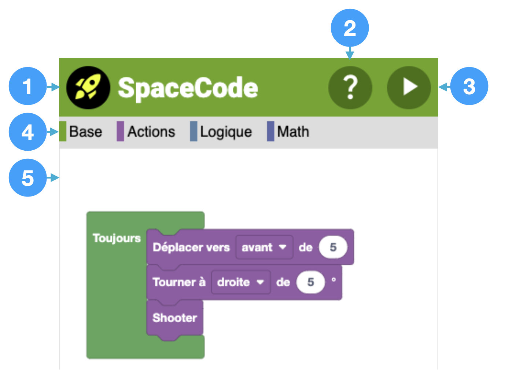
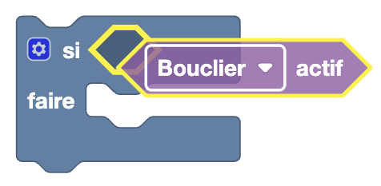
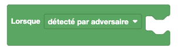
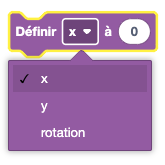
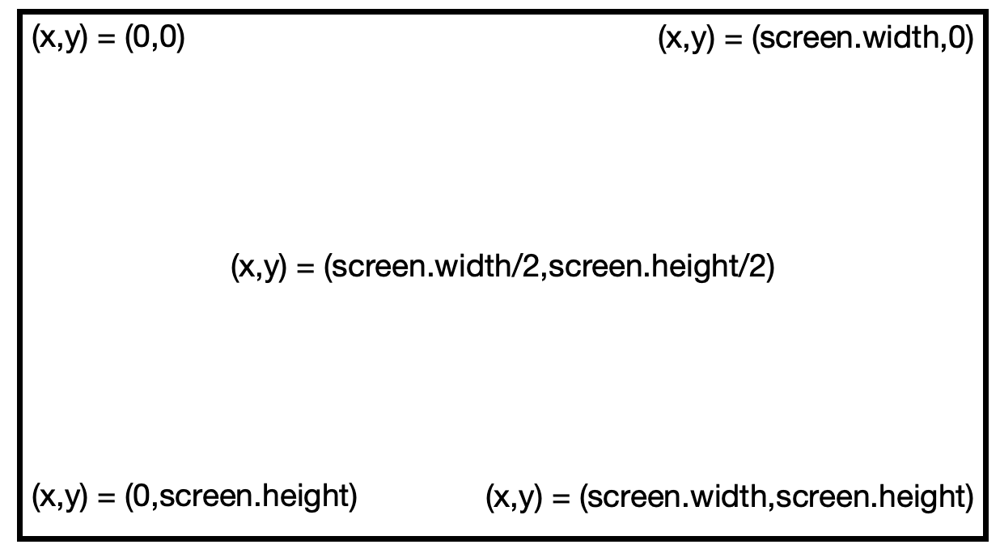
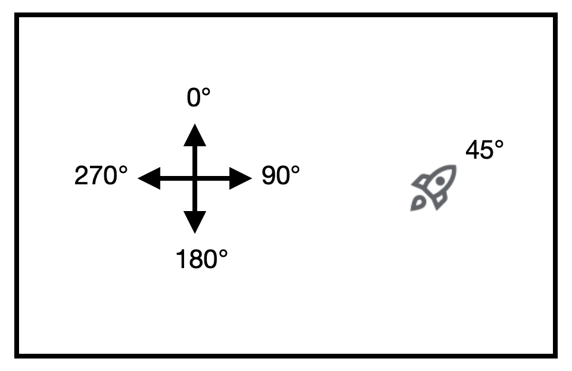
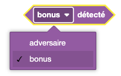
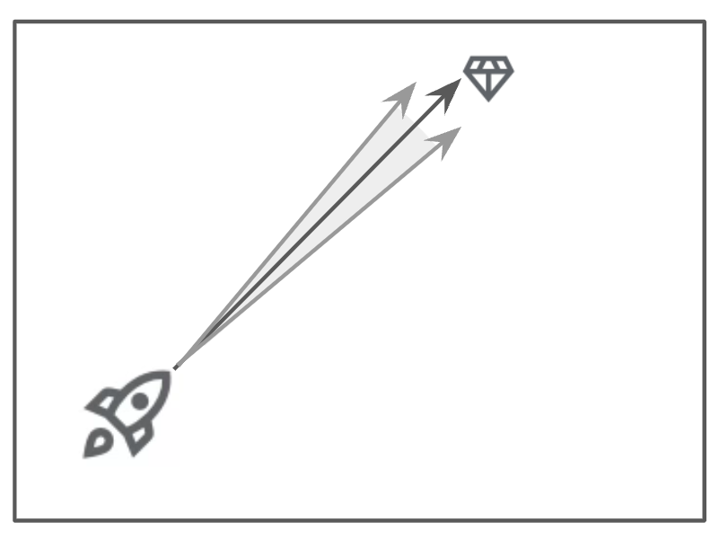
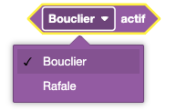
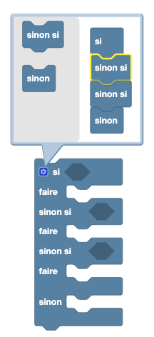

<h1>&#128640; SPACECODE</h1>

Codez votre spacebot et conquérez... l'univers !

## Principes du jeu

Votre spacebot évolue dans une arène dont il ne peut pas sortir avec des adversaires (8 spacebots max).

Il dispose de trois vies &#129505; &#129505; &#129505; et son objectif est de maximiser son score pour gagner &#127942;.

Pour éliminer vos adveraires, vous pouvez shooter mais 1 fois toutes les 3 secondes seulement... sauf en mode rafale.

> Chaque kill vous rapporte 1 point.

### Bonus

Pour vous aider dans votre mission, des bonus peuvent être collectés :

|                                   |                                                                             |
| --------------------------------: | --------------------------------------------------------------------------- |
|         | MGEN vous protège et active votre bouclier !                                |
|           | TNT tire des balles dans 16 directions !                                    |
|          | Harmonie Mutuelle vous restaure une vie !                                   |
|        | Ce cristal vous fait gagner 5 points... L'équivalent de 5 kills d'un coup ! |
|         | Mode rafale, vous pouvez tirer toutes les 100 ms !                          |
|  | Mode rafalex3, vous pouvez tirer 3 balles toutes les 100 ms !!!             |

Lorsque deux spacebots se rentrent dedans, ils perdent une vie... sauf si leur bouclier est activé !

## Bien démarrer

L'interface présente les éléments suivants :

1. Accès à la configuration de son spacebot (couleur, nom, identifiant = téléphone)
1. Accès à la documentation
1. Envoie le code au serveur. Votre spacecode est ajouté automatiquement au jeu en cours
1. Accès aux blocs de code organisés par catégories
1. Espace de codage

Vous devez donc coder le comportement de votre spacebot dans l'espace de codage en utilisant les blocs à votre disposition et en les arrangeant les uns avec les autres.

> ⚠️ Seuls les éléments compris dans des blocs verts seront pris en compte.

> Attention : Pour associer deux blocs, il faut utiliser la partie gauche du bloc utilisé et la faire glisser dans la cible souhaitée jusqu'à ce qu'elle se surligne :

Il est également possible de dupliquer des blocs en

## Références des blocs

### Base

#### Au démarrage

Ce bloc de code sera exécuté au démarrage et lorsque votre spacebot respawn après avoir été tué.

#### Toujours

Le bloc "Toujours" est la boucle principale de votre programme, elle est appelée environ 20 fois par seconde.

#### Lorsque ...

Permet d'exécuter du code lorsque l'événement sélectionné se produit

#### Définir

Permet de définir un des attributs de votre vaisseau.

Pour `x` et `y`, la règle est la suivante pour le positionnement dans l'arène :

Pour `rotation`, la valeur est exprimée en degré et l'orientation est définie ainsi :

### Actions

#### Déplacer

Permet de faire avancer ou reculer le spacebot de l'incrément choisi (en nombre de pixels), éventuellement négatif.

> ⚠️ Ce nombre sera borné entre -30 et 30.

#### Tourner

Permet de faire tourner le spacebot dans le sens et de l'incrément choisis (en degré), éventuellement négatif.

> ⚠️ Ce nombre sera borné entre -20 et 20.

#### Shooter

Tire... dans la limite d'une balle toutes les 3 secondes.
Si le bonus 'Rafale' a été collecté et qu'il est encore actif, les balles pourront être tirées toutes les 100 ms !

### Logique

#### Adversaire/Bonus détecté

Retourne vrai si l'objet choisi (adversaire ou bonus) est dans l'angle de vue du spacebot (+/- 5°), sinon faux

#### Bouclier/Rafale actif

Retourne vrai si le bouclier ou si le mode rafale est actif, sinon faux

#### Si, Sinon si, Sinon

Ce bloc est indispensable pour concevoir des branches conditionnelles dans votre programme en fonction de valeurs booléennes.
Vous pouvez les pamarétrer en utilisant la petite roue crantée bleue et ajouter les blocs souhaités dans le pop-up qui s'ouvre !

## Credits

Projet de Mathurin BODY pour Makers Kids Montlouis, basé sur les travaux de [Chris Courses - Online Multiplayer Game Tutorial](https://www.youtube.com/watch?v=Wcvqnx14cZA) et de [Spishewi synchronized shapes](https://github.com/Spishewi/makerskids-syncronized-shapes) !
